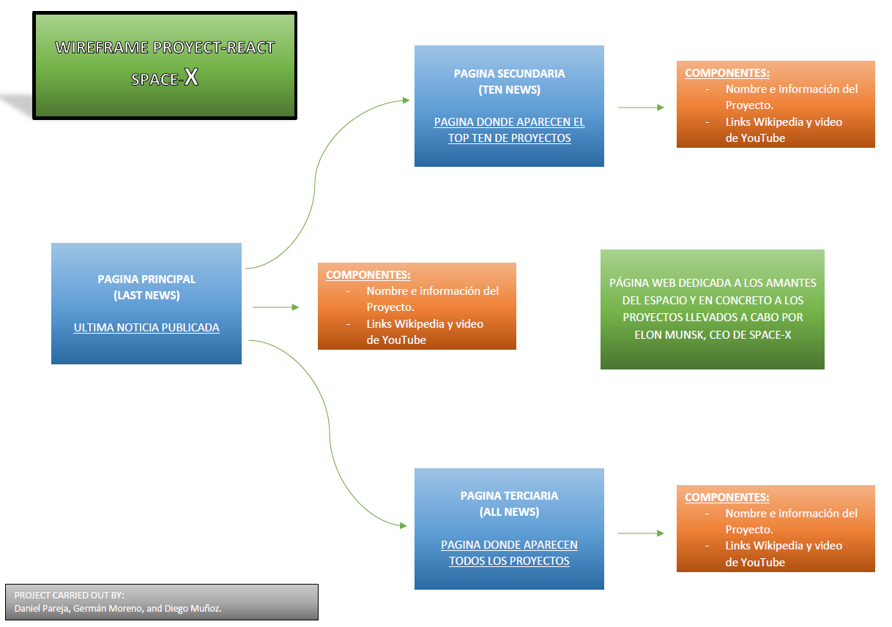

### En que consiste tu proyecto

La información de la API que usarás esta aquí:
https://github.com/r-spacex/SpaceX-API

Usarás la API ahí mostrada para enseñar noticias sobre viajes espaciales.
Tienes que poner un enlace a la última noticia, un enlace a las 10 últimas noticias y un enlace a todas las noticias.

## Información de cada noticia

Todas las páginas muestran noticias sacadas de dicha API, mostrando de cada noticia una foto (suponiendo que hay una), el nombre de la noticia y la información principal. Al ser noticias sobre vuelos espaciales, se incluye tambien información avanzada como si la misión tuvo exito, el código de vuelo, el ID de la misión.
Tambien, en caso de que existan, se incluye en la información de las noticias un enlace a la wikipedia con información adicional de la misión, un video en youtube que muestra el vuelo espacial y enlaces a chats en Reddit acerca de la noticia.

## Materiales

Necesitaremos un fichero js base, 3 ficheros para las páginas, un js para la cabecera y otra para el pie de página.
Hay que diferenciar entre los ficheros de la página principal, la cabecera y el pie, que van en la carpeta de componentes, y los ficheros de las páginas, que iran a la carpeta de páginas.

Necesitaremos unos ficheros scss en los que guardar el estilo de las páginas.

Ya que los datos estan sacados de una API, no necesitaremos una BBDD, pero si necesitamos un js que incluya la lógica de la busqueda de información en la API y de como se mostrará en pantalla dicha información.

## Composición de las páginas

Las 3 páginas empiezan con una cabecera, que contiene los enlaces a las páginas del proyecto, y terminan con un pie de página con agradecimientos a SpaceX, de los que obtuvimos la API usada en el proyecto.
Y entre la cabecera y el pie, estarán las noticias. Ten en cuenta que la cabecera y el pie permaneceran en sus posiciones aunque el usuario descienda por la lista de las noticias.

La página principal, marcada como "Last New" en la cabecera, muestra la última de las noticias que se ha publicado. El enlace "All News" lleva a un enlace con todas las noticias que se han ido publicando en la API. Finalmente tenemos la página del enlace "Last Ten News", la cual muestra una lista con las 10 últimas noticias que estuviesen en el array de la API.

## Obstaculos que nos fuimos encontrando

-Al acceder a los datos de la BBDD, algunas variables no se cargaban y daba errores. Se soluciono haciendo que tras obtener los datos se espere a que esten realmente cargados en el array o variable.
-Algunas variables como el enlace a wikipedia o a youtube pueden estar vacios, por lo que tuvimos que hacer que al mostrar la noticia se compruebe si la variable tiene valor nulo, y en caso afirmativo no se mostrara en pantalla las etiquetas que debian mostrar el valor de dichas variables.
-Las etiquetas para mostrar videos no funcionaban. Por ejemplo, al usar "iframe" daba un error debido a que youtube no permitia usarlo para mostrar sus videos en otras páginas. Afortunadamente encontramos una libreria que si funcionó, llamada "ReactPlayer".
-Estuvimos adaptando el proyecto para que se pueda ver tambien en dispositivos moviles. Esto esta obligando a volver responsivos algunos elementos como las imagenes y los videos. Pero en el caso de los videos daba errores en los que se generaban margenes vacios, por lo que tuvimos que eliminar al final esto.

Agradecimientos a Alexander Wheldon por sus aportaciones para solucionar los problemas.

## Wireframe

